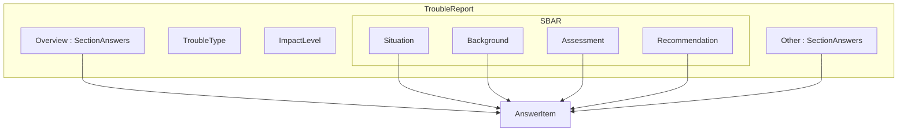
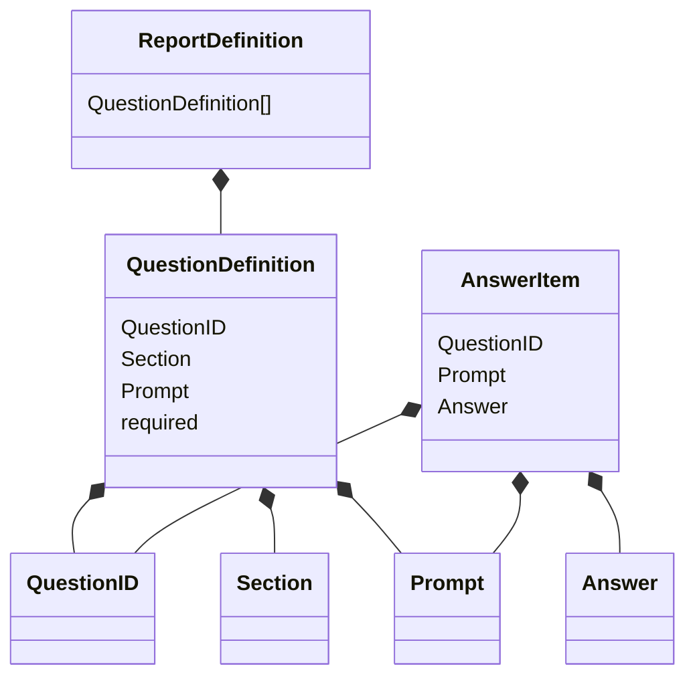
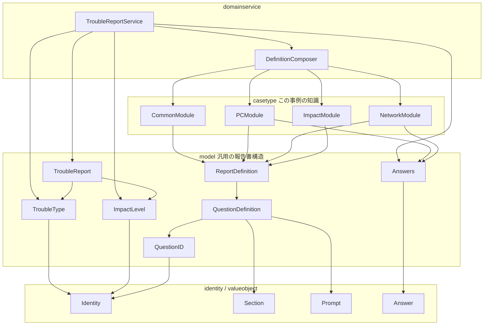
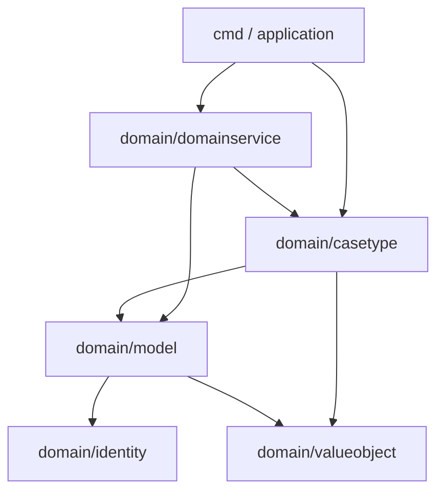
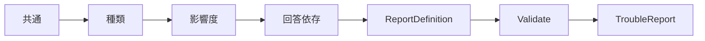

# Domain Service で作る IT トラブル報告書

Go で Domain Service を使い、IT トラブル報告書を生成する小さなサンプルです。

報告書の質問は固定ではありません。共通ルール、トラブルの種類、影響度、それまでの回答を合成して決まります。高度なフォームエンジンではなく、その合成と Validation を Domain Service に置くと何が読みやすくなるかを示す実装です。

この記事では、先にオブジェクトの全体像を見てから、ディレクトリと実際のコードで追い、なぜその置き方にしたかを説明します。

## 全体像

完成形は `TroubleReport` です。種類と影響度を持ち、回答は Overview / SBAR / Other に振り分けられています。



1件の回答 `AnswerItem` は、質問の身元・質問文・回答内容の3つです。質問文が変わっても、対応関係は `QuestionID` で保ちます。



`cmd` のサンプルをオブジェクトとして書くと、次のようになります。PC トラブル、影響度はチーム、電源は入らない、という状態です。

```text
report : TroubleReport
├─ troubleType = pc
├─ impactLevel = team
├─ overview
│   ├─ overview.summary = 始業時にノートPCの電源が入らない
│   └─ impact.affected_people = 4
├─ sbar
│   ├─ situation
│   │   ├─ situation.occurred_at = 2026-08-17 09:00
│   │   └─ pc.power_on = no
│   ├─ background
│   │   ├─ background.before_occurrence = 会議室へ移動して電源ボタンを押した
│   │   └─ pc.ac_adapter_connected = yes
│   ├─ assessment
│   │   ├─ assessment.possible_cause = ACアダプター未接続のままバッテリーが切れた可能性がある
│   │   └─ pc.power_light = no
│   └─ recommendation
│       └─ recommendation.requested_action = 代替PCの貸出と点検を希望します
└─ other
    └─ other.notes = 本日中に会議資料を編集する必要がある
```

電源が入らないと答えたので、画面表示の質問は出ません。代わりに電源ランプと AC アダプターが追加されています。影響度がチームなので、影響人数も Overview に入ります。

## オブジェクトの依存関係

矢印は「使う側 → 使われる側」です。上から下へ読むと、生成の窓口から汎用の値まで一方向です。



ポイントは次の2つです。

- `casetype` は `pc` や `overview.summary` といった、このサンプル固有のカタログと分岐を持つ
- `model` は報告書の型だけを持つ。`casetype` を知らない

`QuestionDefinition` はどの事例でも使える質問の型です。一方「PC の電源は入りますか？」は具体的な事例なので、`casetype.PCModule` が組み立てます。温度感は違いますが、質問の出し分けはこのサンプルの中核なので、どちらも `internal/domain` 配下に置いています。

## パッケージの置き場

```text
cmd / application
        ↓
internal/domain/domainservice   定義の合成と Create
        ↓
internal/domain/casetype        既知の種類・質問・分岐
        ↓
internal/domain/model           報告書と質問の型
        ↓
internal/domain/identity        Identity[Brand]
internal/domain/valueobject     Prompt / Answer / Section
```



`identity` と `valueobject` は他の内部パッケージに依存しません。`model` から `casetype` / `domainservice` へも依存しません。

| パッケージ | 置くもの | 置かないもの |
| --- | --- | --- |
| `valueobject` | `Section` / `Prompt` / `Answer` | トラブル種類や質問一覧 |
| `identity` | `Identity[Brand]` | 具体的な ID の値 |
| `model` | `TroubleReport`、`QuestionDefinition`、Brand 付きの型 | `pc` や質問カタログ |
| `casetype` | 既知の種類・影響度、質問ID、分岐モジュール | 報告書の汎用構造 |
| `domainservice` | 合成と `Create` の窓口 | 事例ごとの質問文 |

ディレクトリは依存の向きと同じで、下が葉です。

```text
.
├── cmd/
│   └── main.go
├── internal/
│   ├── application/
│   │   ├── create_trouble_report.go
│   │   └── create_trouble_report_test.go
│   └── domain/
│       ├── identity/
│       │   ├── identity.go
│       │   └── identity_test.go
│       ├── valueobject/
│       │   ├── answer.go
│       │   ├── prompt.go
│       │   ├── section.go
│       │   └── value_object_test.go
│       ├── model/
│       │   ├── classification.go      TroubleType / ImpactLevel の型
│       │   ├── question.go            QuestionID / QuestionDefinition
│       │   ├── answers.go
│       │   ├── report_definition.go
│       │   ├── section_content.go     AnswerItem / SBAR
│       │   ├── trouble_report.go
│       │   └── validation_error.go
│       ├── casetype/
│       │   ├── trouble_type.go        pc / network
│       │   ├── impact_level.go        individual / team / company_wide
│       │   ├── questions.go           質問IDのカタログ
│       │   ├── common.go
│       │   ├── pc.go
│       │   ├── network.go
│       │   ├── impact.go
│       │   └── definition.go
│       └── domainservice/
│           ├── definition_composer.go
│           └── trouble_report_service.go
├── go.mod
└── README.md
```

テストは各パッケージにあります。上の木は本番コードの置き場です。

## なぜ Domain Service 経由で作るか

提出可能な報告書は、合成した定義の Validation を通過したときだけ作れます。`main` やアプリケーション層が `TroubleReport` を直接組み立てると、必須質問の抜けや分岐ルールの無視が起きやすくなります。

生成窓口は `domainservice.TroubleReportService.Create` に統一しています。

```text
Request DTO
    ↓ application が Parse する
TroubleType, ImpactLevel, Answers
    ↓ TroubleReportService.Create
TroubleReport          Validation を通過した完成形
```

application は文字列をドメインの型へ翻訳し、`Create(troubleType, impactLevel, answers)` を呼びます。必須が足りない入力でも型としては渡せます。提出可能かどうかは Domain Service が判定します。通過した回答だけが Overview / SBAR / Other に入ります。

Go には「兄弟パッケージだけに公開する」仕組みがありません。`model.NewTroubleReport` は `domainservice` から呼べるよう公開していますが、アプリケーション層からは直接呼ばない、というルールにしています。

## 質問はどう決まるか

`DefinitionComposer` は、次の順で `ReportDefinition` を合成します。

1. 共通定義（概要、発生時刻、希望対応など）
2. トラブル種類の基本定義（PC なら電源、ネットワークなら接続種別）
3. 影響度の定義（チーム以上なら影響人数、全社なら代替手段）
4. 回答に依存する定義（電源が入らないなら電源ランプ、など）



PC で電源が入らないと答えた場合だけ、電源ランプと AC アダプターが追加されます。先回りしては出しません。

影響度が全社のときは、代替手段の質問を足し、共通の「希望する対応」を必須へ上書きします。同じ質問IDは重複追加しません。

未知のトラブル種類や影響度は、DTO を `casetype.ParseTroubleType` / `ParseImpactLevel` する時点でエラーになります。

## 値オブジェクトと Identity

身元を持たない汎用の値は `valueobject` に置きます。標準ライブラリ以外に依存しません。

- `Section` は未知の値では作れない
- `Prompt` は空の質問文を許さない
- `Answer` は1つの回答内容（`yes` / `no` など）

`TroubleType` / `ImpactLevel` / `QuestionID` の型は `model` の `Identity[Brand]` です。同じ文字列でも、別 Brand の ID へは代入できません。既知の値（`pc`、`network`、質問カタログ）だけが `casetype` にあります。

## コードを追う

図の下から、実際のコードを上へ辿ります。

### 葉: Identity と Prompt

`Identity` は Brand で別概念を混ぜないための型です。空文字では作れません。

```go
// internal/domain/identity/identity.go
type Identity[Brand any] struct {
	value string
}

func NewIdentity[Brand any](value string) (Identity[Brand], error) {
	if strings.TrimSpace(value) == "" {
		return Identity[Brand]{}, &EmptyIdentityError{}
	}
	return Identity[Brand]{value: value}, nil
}
```

`Prompt` も空を許さない値オブジェクトです。カタログの静的な質問文は `MustPrompt` で書きます。

```go
// internal/domain/valueobject/prompt.go
func NewPrompt(value string) (Prompt, error) {
	if strings.TrimSpace(value) == "" {
		return Prompt{}, &EmptyPromptError{}
	}
	return Prompt{value: value}, nil
}
```

### 汎用構造: 型だけ model に置く

`TroubleType` は Identity の別名です。`pc` という値はここにはありません。

```go
// internal/domain/model/classification.go
type TroubleBrand struct{}

type TroubleType = identity.Identity[TroubleBrand]
```

質問も同じです。`QuestionDefinition` は ID・章・質問文・必須かどうかだけを持ちます。

```go
// internal/domain/model/question.go
type QuestionBrand struct{}

type QuestionID = identity.Identity[QuestionBrand]

type QuestionDefinition struct {
	id       QuestionID
	section  valueobject.Section
	prompt   valueobject.Prompt
	required bool
}
```

### 事例知識: casetype が既知の値と分岐を持つ

種類のカタログと Parse は `casetype` です。未知の文字列はここで落ちます。

```go
// internal/domain/casetype/trouble_type.go
var (
	TroubleTypePC      = model.MustTroubleType("pc")
	TroubleTypeNetwork = model.MustTroubleType("network")
)

func ParseTroubleType(value string) (model.TroubleType, error) {
	for _, candidate := range []model.TroubleType{TroubleTypePC, TroubleTypeNetwork} {
		if value == candidate.String() {
			return candidate, nil
		}
	}
	return model.TroubleType{}, &UnknownTroubleTypeError{Value: value}
}
```

質問IDもカタログです。`model.MustQuestionID` で型だけ借りて、値は casetype が持ちます。

```go
// internal/domain/casetype/questions.go
var (
	QuestionOverviewSummary      = model.MustQuestionID("overview.summary")
	QuestionPCPowerOn            = model.MustQuestionID("pc.power_on")
	QuestionPCPowerLight         = model.MustQuestionID("pc.power_light")
	QuestionPCACAdapterConnected = model.MustQuestionID("pc.ac_adapter_connected")
	QuestionPCScreenVisible      = model.MustQuestionID("pc.screen_visible")
)
```

PC の分岐は `PCModule` です。電源の回答がまだなければ、先の質問は出しません。

```go
// internal/domain/casetype/pc.go
func (PCModule) AnswerDependentDefinition(answers model.Answers) model.ReportDefinition {
	value, ok := answers.Get(QuestionPCPowerOn)
	if !ok || value.IsBlank() {
		return model.ReportDefinition{}
	}

	switch {
	case value.IsNo():
		return mustDefinition(
			model.NewQuestionDefinition(
				QuestionPCPowerLight,
				valueobject.SectionAssessment,
				valueobject.MustPrompt("電源ランプは点灯していますか？"),
				true,
			),
			model.NewQuestionDefinition(
				QuestionPCACAdapterConnected,
				valueobject.SectionBackground,
				valueobject.MustPrompt("ACアダプターは接続されていますか？"),
				true,
			),
		)
	case value.IsYes():
		return mustDefinition(
			model.NewQuestionDefinition(
				QuestionPCScreenVisible,
				valueobject.SectionSituation,
				valueobject.MustPrompt("画面は表示されていますか？"),
				true,
			),
		)
	default:
		return model.ReportDefinition{}
	}
}
```

### 合成: Composer はモジュールを足すだけ

`DefinitionComposer` は質問文を知りません。共通 → 種類 → 影響度 → 回答依存の順で `Combine` します。

```go
// internal/domain/domainservice/definition_composer.go
func (c DefinitionComposer) Compose(
	troubleType model.TroubleType,
	impactLevel model.ImpactLevel,
	answers model.Answers,
) (model.ReportDefinition, error) {
	if !casetype.IsKnownTroubleType(troubleType) {
		return model.ReportDefinition{}, &casetype.UnknownTroubleTypeError{Value: troubleType.String()}
	}
	if !casetype.IsKnownImpactLevel(impactLevel) {
		return model.ReportDefinition{}, &casetype.UnknownImpactLevelError{Value: impactLevel.String()}
	}

	typeModule, err := c.typeModule(troubleType)
	if err != nil {
		return model.ReportDefinition{}, err
	}

	def := c.common.Definition()
	def, err = def.Combine(typeModule.BaseDefinition())
	if err != nil {
		return model.ReportDefinition{}, err
	}
	def, err = def.Combine(c.impact.Definition(impactLevel))
	if err != nil {
		return model.ReportDefinition{}, err
	}
	def, err = def.Combine(typeModule.AnswerDependentDefinition(answers))
	if err != nil {
		return model.ReportDefinition{}, err
	}
	return c.impact.ApplyRequiredOverrides(def, impactLevel)
}
```

### 生成窓口: Validate を通ったものだけ Report になる

```go
// internal/domain/domainservice/trouble_report_service.go
func (s TroubleReportService) Create(
	troubleType model.TroubleType,
	impactLevel model.ImpactLevel,
	answers model.Answers,
) (*model.TroubleReport, error) {
	def, err := s.composer.Compose(troubleType, impactLevel, answers)
	if err != nil {
		return nil, err
	}
	if err := def.Validate(answers); err != nil {
		return nil, err
	}
	return model.NewTroubleReport(troubleType, impactLevel, def, answers), nil
}
```

アプリケーション層は文字列 DTO を受け取り、`casetype.Parse*` で既知の種類へ変換してから Service に渡します。Domain Service に DTO は渡しません。

```go
// internal/application/create_trouble_report.go
func (u CreateTroubleReportUseCase) Execute(req CreateTroubleReportRequest) (*model.TroubleReport, error) {
	troubleType, err := casetype.ParseTroubleType(req.TroubleType)
	if err != nil {
		return nil, err
	}
	impactLevel, err := casetype.ParseImpactLevel(req.ImpactLevel)
	if err != nil {
		return nil, err
	}
	answers, err := model.NewAnswersFromStrings(req.Answers)
	if err != nil {
		return nil, err
	}
	return u.service.Create(troubleType, impactLevel, answers)
}
```

`cmd` は PC・チーム・電源オフの例を流すだけです。

```go
// cmd/main.go
service := domainservice.NewTroubleReportService(domainservice.NewDefinitionComposer())
usecase := application.NewCreateTroubleReportUseCase(service)

report, err := usecase.Execute(application.CreateTroubleReportRequest{
	TroubleType: casetype.TroubleTypePC.String(),
	ImpactLevel: casetype.ImpactLevelTeam.String(),
	Answers: map[string]string{
		casetype.QuestionOverviewSummary.String():      "始業時にノートPCの電源が入らない",
		casetype.QuestionPCPowerOn.String():            valueobject.AnswerNo.String(),
		casetype.QuestionPCPowerLight.String():         valueobject.AnswerNo.String(),
		casetype.QuestionPCACAdapterConnected.String(): valueobject.AnswerYes.String(),
		casetype.QuestionImpactAffectedPeople.String(): "4",
		// 共通の必須回答は省略
	},
})
```

## 実行方法

```bash
go run ./cmd
```

PC トラブル、影響度はチーム全体、電源が入らない、という例を標準出力へ出します。

```bash
go test ./...
```
