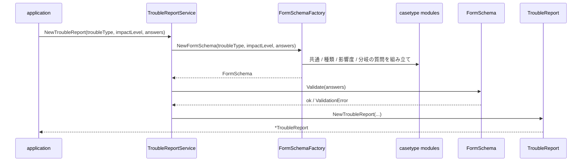
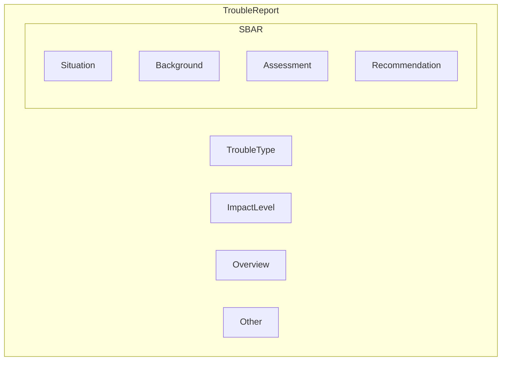
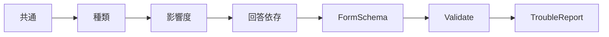

# Domain Service で作る IT トラブル報告書

## はじめに

DDDのDomainServiceを学習したく、記事を書きました。DomainモデルやValueObjectで完結することが多く、DomainServiceを扱った事がなかったのでこの機会に学習していきます。

この記事では、Go で **IT トラブル報告書** を題材に Domain Service の置き場所と役割を体験するための Hands-on サンプルです。報告書の質問は固定ではなく、トラブルの種類・影響度・これまでの回答によって変わります。その「条件に応じた質問の組み立て」と「提出可能かどうかの判定」を Domain Service に置いています。

## DomainServiceとは？

Domain Service は、**1つの Entity や Value Object だけでは表現しにくいドメインの処理** を置く場所です。

たとえばこのサンプルでは、報告書（`TroubleReport`）を作る前に次のような判断が必要になります。

- 共通の質問に加えて、PC トラブルなら電源の質問を出す
- 影響度がチーム以上なら影響人数を聞く
- 「電源は入りますか？」への回答が `no` なら、電源ランプや AC アダプターの質問を追加する
- 上記を踏まえたうえで、必須回答が揃っているか検証する

これらは `TroubleReport` 単体の責務ではなく、`CommonModule` や `PCModule` など複数の知識をまたいで協調する処理です。Entity / Value Object に無理に押し込むと、モデルが肥大化したり、application 層にビジネスルールが漏れたりしやすくなります。

Domain Service はその中間に立ち、**ドメイン知識の orchestration（調整）** を担います。

| 置き場 | 役割 | このサンプルでの例 |
| --- | --- | --- |
| Entity / Aggregate | 状態と不変条件を持つ | `TroubleReport` |
| Value Object | 値そのもののルール | `Section`, `Prompt`, `Answer` |
| Domain Service | 複数のドメイン要素をまたぐ処理 | `TroubleReportService`, `FormSchemaFactory` |

Domain Service は「サービス層（application）」とは別物です。application は HTTP リクエストや DTO の変換を担当し、**ビジネスルールそのもの** は domain に留めます。

## Hands-on

### サンプルの例

このリポジトリの題材は **IT トラブル報告書の作成** です。

利用者はフォームに回答し、最終的に SBAR 形式の報告書が生成されます。質問内容は入力途中で変わります。

```text
入力
├─ トラブル種類: pc / network
├─ 影響度: individual / team / company_wide
└─ 回答: 質問ID → 回答内容

出力
└─ TroubleReport（Overview / SBAR / Other に整理された報告書）
```

#### 実行例

```bash
go run ./cmd
go test ./...
```

`cmd/main.go` では、PC トラブル・影響度チーム・電源が入らない、というケースを流しています。

```go
report, err := usecase.Execute(application.CreateTroubleReportRequest{
	TroubleType: casetype.TroubleTypePC.String(),
	ImpactLevel: casetype.ImpactLevelTeam.String(),
	Answers: map[string]string{
		casetype.QuestionOverviewSummary.String():      "始業時にノートPCの電源が入らない",
		casetype.QuestionPCPowerOn.String():            "no",
		casetype.QuestionPCPowerLight.String():         "no",
		casetype.QuestionPCACAdapterConnected.String():  "yes",
		casetype.QuestionImpactAffectedPeople.String(): "4",
		// ... その他の必須回答
	},
})
```

生成される報告書のイメージです。

```text
report : TroubleReport
├─ troubleType = pc
├─ impactLevel = team
├─ overview
│   ├─ overview.summary = 始業時にノートPCの電源が入らない
│   └─ impact.affected_people = 4
├─ sbar
│   ├─ situation
│   │   ├─ situation.occurred_at = 2026-08-17 09:00
│   │   └─ pc.power_on = no
│   ├─ background
│   │   └─ pc.ac_adapter_connected = yes
│   ├─ assessment
│   │   └─ pc.power_light = no
│   └─ recommendation
│       └─ recommendation.requested_action = 代替PCの貸出と点検を希望します
└─ other
    └─ other.notes = 本日中に会議資料を編集する必要がある
```

電源が入らない（`no`）と答えたため、画面表示の質問は出ず、電源ランプと AC アダプターの質問が追加されています。影響度がチームのため、影響人数も Overview に含まれます。

#### 処理の流れ



### 説明

#### 全体像

完成形は `TroubleReport` です。種類と影響度を持ち、回答は Overview / SBAR / Other に振り分けられます。



1件の回答 `AnswerItem` は、質問 ID・質問文・回答内容の3つで構成されます。質問文が変わっても、対応関係は `QuestionID` で保ちます。

#### なぜ Domain Service 経由で作るか

提出可能な報告書は、**合成した FormSchema の Validation を通過したときだけ** 作れます。

`main` や application 層が `model.NewTroubleReport` を直接呼ぶと、必須質問の抜けや分岐ルールの無視が起きやすくなります。生成窓口は `TroubleReportService.NewTroubleReport` に統一しています。

```text
Request DTO
    ↓ application が Parse する
TroubleType, ImpactLevel, Answers
    ↓ TroubleReportService.NewTroubleReport
TroubleReport          Validation を通過した完成形
```

Go には「兄弟パッケージだけに公開する」仕組みがないため、`model.NewTroubleReport` は公開されています。ただし **application からは直接呼ばない** というルールにしています。

#### パッケージ構成

依存の向きは上から下です。

```text
cmd / application
        ↓
internal/domain/domainservice   FormSchema の生成と TroubleReport の生成
        ↓
internal/domain/casetype        既知の種類・質問・分岐（事例知識）
        ↓
internal/domain/model           報告書と質問の型（汎用構造）
        ↓
internal/domain/identity        Identity[Brand]
internal/domain/valueobject     Prompt / Answer / Section
```

| パッケージ | 置くもの | 置かないもの |
| --- | --- | --- |
| `valueobject` | `Section` / `Prompt` / `Answer` | トラブル種類や質問一覧 |
| `identity` | `Identity[Brand]` | 具体的な ID の値 |
| `model` | `TroubleReport`、`FormSchema`、`QuestionDefinition` | `pc` や質問カタログ |
| `casetype` | 既知の種類・影響度、質問ID、分岐モジュール | 報告書の汎用構造 |
| `domainservice` | FormSchema 生成と TroubleReport 生成の窓口 | 事例ごとの質問文 |

```text
.
├── cmd/main.go
├── internal/
│   ├── application/          ユースケース（DTO → ドメイン型 → Service 呼び出し）
│   └── domain/
│       ├── domainservice/    TroubleReportService, FormSchemaFactory
│       ├── casetype/         CommonModule, PCModule, NetworkModule, ImpactModule
│       ├── model/            TroubleReport, FormSchema, QuestionDefinition
│       ├── identity/         Identity[Brand]
│       └── valueobject/      Section, Prompt, Answer
└── go.mod
```

#### Domain Service の中身

Domain Service は2つの部品に分かれています。

**1. `FormSchemaFactory` — 質問項目の定義を生成する**

条件（トラブル種類・影響度・回答）を受け取り、今回有効な `FormSchema` を返します。

```go
schema, err := factory.NewFormSchema(troubleType, impactLevel, answers)
```

内部では次の順でモジュールを `Combine` します。

1. 共通定義（概要、発生時刻、希望対応など）
2. トラブル種類の基本定義（PC なら電源、ネットワークなら接続種別）
3. 影響度の定義（チーム以上なら影響人数、全社なら代替手段）
4. 回答に依存する定義（電源が入らないなら電源ランプ、など）



**2. `TroubleReportService` — 報告書を生成する窓口**

```go
report, err := service.NewTroubleReport(troubleType, impactLevel, answers)
```

FormSchema を生成し、必須回答を検証してから `TroubleReport` を組み立てます。質問項目の定義だけ欲しい場合は `NewFormSchema` も使えます。

```go
schema, err := service.NewFormSchema(troubleType, impactLevel, answers)
```

#### 事例知識は casetype に閉じ込める

「PC の電源は入りますか？」のような具体的な質問は `casetype.PCModule` が持ちます。`model` は質問の**型**（`QuestionDefinition`）だけを知り、`pc` という値や分岐条件は知りません。

```go
// casetype/pc.go — 電源の回答に応じて分岐
func (PCModule) NewAnswerDependentFormSchema(answers model.Answers) model.FormSchema {
	value, ok := answers.Get(QuestionPCPowerOn)
	if !ok || value.IsBlank() {
		return model.FormSchema{} // まだ分岐できない
	}
	switch {
	case value.IsNo():
		// 電源ランプ、ACアダプターの質問を追加
	case value.IsYes():
		// 画面表示の質問を追加
	}
}
```

トラブル種類が増えても、`casetype` にモジュールを足し、`FormSchemaFactory` の差し替え点を増やすだけで対応できます。`model` や application は変更不要です。

#### このサンプルで学べること

- Domain Service を置くべきタイミング（複数のドメイン知識をまたぐ処理）
- Entity / Value Object / Domain Service の責務分担
- 事例知識（`casetype`）と汎用構造（`model`）の分離
- 条件に応じた FormSchema 生成と Validation の流れ
- application 層と domain 層の境界（DTO は application、ルールは domain）

#### 詳細ドキュメント

より詳しい説明は `internal/domain/domainservice/` 配下にあります。

- [trouble_report_service.md](./internal/domain/domainservice/trouble_report_service.md) — 報告書生成の窓口
- [form_schema_factory.md](./internal/domain/domainservice/form_schema_factory.md) — 質問項目定義の生成
