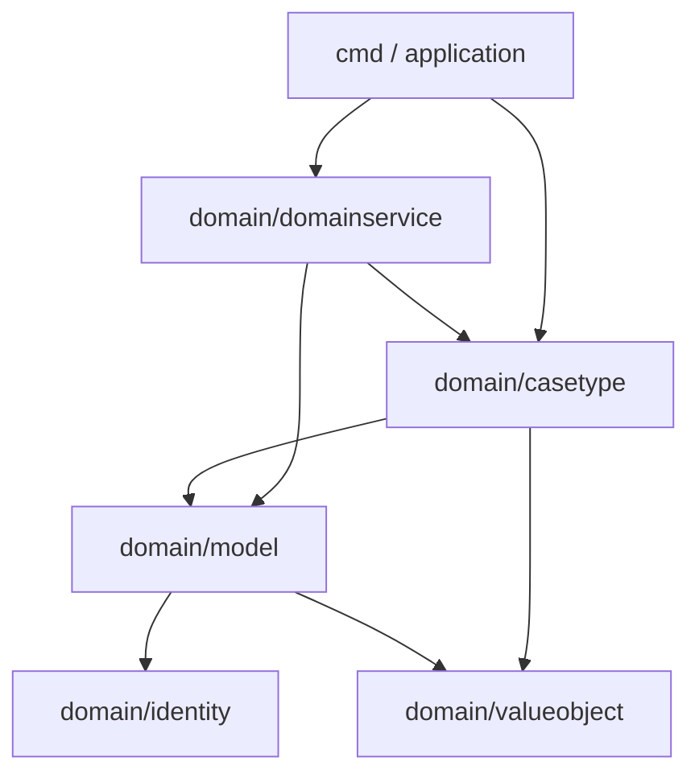
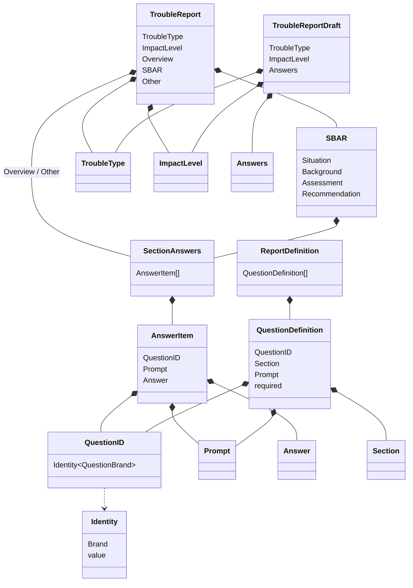

# Domain Service で作る IT トラブル報告書

Go で Domain Service を使い、IT トラブル報告書を生成する小さなサンプルです。

## このサンプルで学ぶこと

報告書の質問と Validation は、次のルールを合成して決まります。

- すべての報告書に共通するルール
- トラブル種類ごとのルール
- 影響度ごとのルール
- それまでの回答によって変化するルール

高度なフォームエンジンではなく、Domain Service の役割が読み取れる小さい実装にしています。

## domain 配下の分割

`internal/domain` の中を次のように分けています。

- `valueobject` … 身元を持たない汎用の値（`Prompt` / `Answer` / `Section`）
- `identity` … Brand 型 `Identity[Brand]`
- `model` … 質問定義と報告書の構造（`QuestionDefinition` / `TroubleReport` など）
- `casetype` … この事例固有の知識（既知の種類・影響度、質問カタログ、分岐ルール）
- `domainservice` … 定義の合成と提出可能かの判断

`casetype` は汎用の報告書構造より具体的ですが、質問の出し分けはこのサンプルの中核なので `internal/domain` 配下に置いています。

依存方向は次の一方向です。

```text
cmd / application
        ↓
internal/domain/domainservice
        ↓
internal/domain/casetype
        ↓
internal/domain/model
        ↓
internal/domain/identity
internal/domain/valueobject
```

`identity` と `valueobject` は他の内部パッケージに依存しません。`model` から `casetype` / `domainservice` へも依存しません。



## TroubleReport を Domain Service 経由で生成する理由

提出可能な報告書は、合成した定義による Validation を通過したときだけ作れます。
アプリケーション層や `main` が `TroubleReport` を直接組み立てると、必須質問の抜けや分岐ルールの無視が起きやすくなります。

そのため、生成窓口は `domainservice.TroubleReportService.Create` に統一しています。

## ルールの合成

`DefinitionComposer` は、次の順番で `ReportDefinition` を合成します。

1. 共通定義
2. トラブル種類固有の定義
3. 影響度固有の定義
4. 回答に依存する定義

たとえば PC トラブルで電源が入らないと答えた場合だけ、電源ランプと AC アダプターの質問が追加されます。
影響度が全社の場合は、代替手段の質問が追加され、共通の「希望する対応」も必須になります。

## 値オブジェクトと Identity

身元を持たない汎用の値は `internal/domain/valueobject` に置きます。このパッケージは標準ライブラリ以外に依存しません。

- `Section` は未知の値では生成できない
- `Prompt` は空の質問文を許さない
- `Answer` は1つの回答内容（`yes` / `no` など）

`TroubleType` / `ImpactLevel` / `QuestionID` の型そのものは `model` の Brand 型 `Identity[Brand]` です。
同じ文字列でも別 Brand の ID とは代入できません。
一方、このサンプルで扱う既知の値（`pc` / `network`、質問カタログ、分岐ルール）は `casetype` に集めます。
`QuestionDefinition` と `ReportDefinition` は汎用の質問構造なので `model` に置きます。

未知のトラブル種類や影響度は、DTO を `casetype.ParseTroubleType` / `ParseImpactLevel` で変換する時点でエラーになります。
`TroubleReport` は提出可能な報告書であり、`internal/domain/model` の生成結果として扱います。

報告書の包含関係は次のとおりです。



## Draft と Report を分けた理由

`TroubleReportDraft` は入力途中の状態です。回答が足りていても、まだ分岐先の質問に答えていなくても構いません。
`TroubleReport` は提出可能な完成形です。Validation を通過した回答だけが Overview / SBAR / Other に振り分けられます。

## 生成経路についての制約

Go には「特定の兄弟パッケージだけに公開する」仕組みがありません。
そのため `model.NewTroubleReport` は `domainservice` から呼べるよう公開していますが、アプリケーション層から直接呼ばない、というアーキテクチャルールにしています。

プロジェクト内では次の経路だけを使います。

```text
Request DTO
    ↓ application で変換
model.TroubleReportDraft
    ↓
domainservice.TroubleReportService.Create
    ↓
model.TroubleReport
```

## 実行方法

```bash
go run ./cmd
```

PC トラブル、影響度はチーム全体、電源が入らない、という例で報告書を標準出力へ表示します。

## テスト方法

```bash
go test ./...
```
