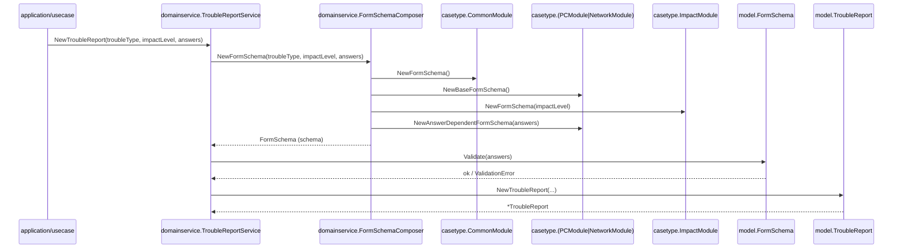

## `trouble_report_service.go` がやること（全体像）

`TroubleReportService` は、最終成果物である `model.TroubleReport` を作ります。
その前に、与えられた `troubleType / impactLevel / answers` に応じて「今回聞くべき質問項目（FormSchema）」を組み立て、必須回答が揃っているかを検証してから報告書を構築します。

このサービスの役割は大きく 2 段階です。

1. **質問項目の定義（FormSchema）を生成する**（`FormSchemaComposer` に委譲）
2. **FormSchema に基づいて TroubleReport を生成する**（+ `Validate`）

## シーケンス図（`NewTroubleReport` の流れ）

## 公開 API

### `NewFormSchema(troubleType, impactLevel, answers) (model.FormSchema, error)`

質問項目の定義（FormSchema）を**生成**する API です。
画面に何を表示するか確認したいときに使います。`TroubleReport` 自体は生成しません。

### `NewTroubleReport(troubleType, impactLevel, answers) (*model.TroubleReport, error)`

報告書（TroubleReport）を**生成**する API です。処理は次の順で行われます。

1. `composer.NewFormSchema(...)` で **その回答に応じた FormSchema** を生成する
2. `schema.Validate(answers)` で **必須回答の不足が無いか** を検証する
3. `model.NewTroubleReport(...)` で **最終的な `TroubleReport`** を構築する

この順番にするのがポイントで、最初に回答を使って分岐質問を確定し、その後で「確定した必須質問に対する回答が揃っているか」をチェックします。

## エラーの出どころ（代表）

- `FormSchemaComposer.NewFormSchema` 中
  - 未知の `troubleType / impactLevel`
  - 質問項目の合成で矛盾（重複質問 ID など）
- `schema.Validate(answers)` 中
  - 必須回答の不足（`model.ValidationError`）
